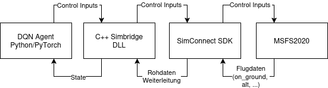
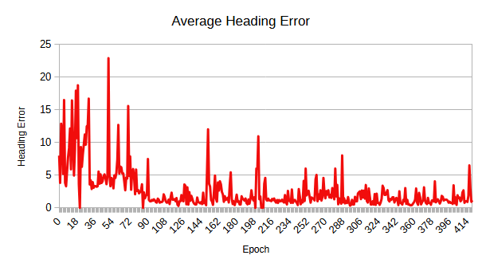
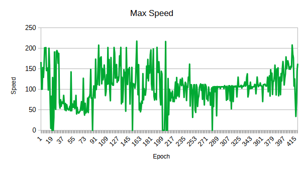
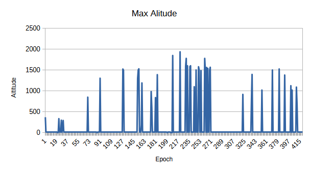

# Deep Reinforcement Learning für autonomen Start im Microsoft Flight Simulator 2020

## Abstract
### Einleitung:
Künstliche Intelligenz (KI) und Reinforcement Learn-
ing (RL) gewinnen in der Luftfahrt zunehmend an Bedeutung zur
Steigerung von Sicherheit und Effizienz. Diese Arbeit untersucht
den Einsatz von Deep Reinforcement Learning im Airbus A320
als unterstützendes Überwachungssystem. Die KI soll den Pi-
loten nicht ersetzen, sondern bei realen Flügen den Startvorgang
simulieren und dessen Handlungen mit den optimalen Aktionen
des RL-Agenten vergleichen, um potenzielle Fehler frühzeitig zu
erkennen.

### Motivation & Zielsetzung:
Warum eine KI als Co-Pilot? Die Start-
phase erfordert absolute Präzision. Anstatt den Piloten zu erset-
zen, fungiert dieser RL-Agent als redundante Sicherheitsinstanz.
Das System gleicht die Aktionen im Cockpit in Echtzeit mit einer
berechneten Optimalsteuerung ab. Weichen die Eingaben kritisch
ab, warnt die KI sofort, wodurch die Luftfahrt noch sicherer wird,
als sie ohnehin schon ist.

### Anforderungen an den RL-Agenten:
- Centerline halten
- Rotation bei Vrotate
- Stabile Steigung durch kontrollierte Control-Eingaben
- Halten des Headings

### Ergebnis:
Nach ungefähr 500 Epochen hat die KI gelernt eigenständig konsistent anbzuheben und dabei sicher die Centerline des Runways zu halten.

## Wie funktioniert es?


### Komponenten
- Deep-Q-Network mit PyTorch Umsetzung
- Custom SimBridge DLL
- SimConnect SDK
- Microsoft Flight Simulator 2020

## Environment
### Observation Space
Die KI bekommt 11 verschiedene Zustandsinformationen (11-dimensionaler Zustandsvektor), mit Hilfe derer sie die nächste (beste) Aktion durchführen kann.

| Feature             | Beschreibung                               | Normierung                  |
|---------------------|--------------------------------------------|-----------------------------|
| Pitch               | Längsneigung                               | s.pitch / 25.0              |
| Bank                | Seitenneigung                              | s. bank / 45.0              |
| Altitude            | Flughöhe                                   |                             |
| Airspeed            | Fluggeschwindigkeit                        | s.airspeed / 200.0          |
| Vertical Speed (vs) | Vertikale Geschwindigkeit                  | s.vs / 3000.0               |
| Heading             | Ausrichtung (Kurs)                         |                             |
| Alt_Above_Ground    | Höhe über dem Boden                        | s.alt_above_ground / 1000.0 |
| Sim_On_Ground       | Ist das Flugzeug auf dem Boden?            |                             |
| Runway X            | Seitlicher Abstand zur Centerline          | s.runway_x /20.0            |
| Runway Y            | Position des Flugzeugs entlang des Runways | s.runway_y / 10.0           |
| Runway Z            | Höhe relativ zum Runway                    |                             |

### Action Space
| ID | Aktion              |
|----|---------------------|
| 0  | Aileron links       |
| 1  | Aileron rechts      |
| 2  | elevator links      |
| 3  | elevator rechts     |
| 4  | Rudder links        |
| 5  | Rudder rechts       |
| 6  | Rudder mitte        |

Throttle und Parkbremse werden automatisch gesetzt, da die Kontrolle des Throttles im A320 Neo von FBW bei der Ansteuerung nicht immer zuverlässig funktioniert haben. Bei der Parkbremse ist es in der Realität auch sinnvoller, wenn die von einem Menschen gelöst wird.

### Reward Funktion
Unterteilung in:
1. Basisrewards
2. Belohnung und Bestrafung auf dem Boden
3. Belohnung und Bestrafung in der Luft
4. Terminal Reward

#### 1. Basisrewards
- Belohnung der "perfekten Mitte" durch Glockenkurve
    - Agent muss klar wissen, wenn er auf einer geraden Linie fährt
- Strafe für weiteres Weglenken von der Mitte
    - Wäre dies nur durch Heading geregelt, könnte der Agent auch 20m neben dem RUnway fahren, aber trotzdem das Heading halten
- Strafe für das Abweichen von der Richtung des Runways

#### 2. Belohnung und Bestrafung auf dem Boden
- Lernen das Rudder stabil zu halten
    - Soll die KI dazu zwingen das Rudder nur so viel, wie unbeding notwendig zu bewegen
- Fortschrittsbelohnung
    - Solange das Flugzeug auf der Startbahn bleibt, gibt es eine Belohnung für die Geschwindigkeit
- Halten des Headings
    - Bonus für das Folgen der Centerline und Bestrafung bei Abweichungen über 2°
- Bestrafung für Elevator Ziehen unter Vrotate
    - Wenn die Geschwindigkeit unter Vrotate ist, sollte die Nase des Flugzeugs noch nicht angehoben werden (KI hat während des Trainings oft schon bei 90kts (erfolgreich) versucht abzuheben, um die Punkte für "in der Luft" zu bekommen)
- Belohnung für leichtes Drücken
    - Soll die KI dazu bringen die Nase lieber länger unten zu halten
    - darf aber auch nicht zu stark sein, weil sonst das Flugzeug ausbrechen kann
- Bei genug Geschwindigkeit
    - starker Bonus für's Nase nach oben ziehen
    - Bestrafung für das Nase nach unten drücken

#### 3. Belohnung und Bestrafung in der Luft
- Solange die KI in der Luft in einem akzeptablen Vr Bereich bleibt, gibt es eine Belohnung
- Starke Bestafung für zu geringe Geschwindigkeit in der Luft nach dem Start
- Bestrafung für das Benutzen des Rudders in der Luft
    - Da bei einem Triebwerksausfall während des Startvorgangs mit dem Rudder allerdings gegengesteuert werden muss, um das Flugzeug nicht abdriften zu lassen, sollte die KI für diese Fälle explizit trainiert werden
- Belohnung und Bestrafungen für die Vertikale Geschwindigkeit des Flugzeugs
    - darf nicht zu Flach sein, da das Flugzeug nach dem Start an Höhe gewinnen sollte
    - darf nicht zu hoch sein, damit das Flugzeug nicht in einen Stall gerät
- Angegebener Bereich des Pitch Winkels
- Bestrafung für Bank (sollte ausgearbeitet werden)
- Bestrafung für Heading Abweichung (sollte auch nochmal überarbeitet werden)

#### Terminal Reward
- Wenn das Flugzeug abgehoben ist, Heading stimmt und Vertical Speed in einem Bereich ist, der okay ist:
    - erhält die KI eine riesige Belohnung

### Abbruch Methode
- Curriculum Learning &rarr; KI hat in den ersten Epochen mehr Spielraum für Abweichungen, welcher aber je nach Epoche kleiner wird
- Abbruch wenn der Runway verlassen wurde
- Abbruch wenn das Flugzeug nach dem Start zu tief ist
- Abbruch wenn das Flugzeug zu weit vom Heading abkommt
- Abbcuh bei zu steiler Seitenneigung
- Abbruch wenn zu früh abgehoben wurde
- Abbruch, aber mit Erfolg, wenn eine Höhe von 1500 erreicht wurde
- Abbruch nach 850 steps (Wert orientiert sich an der Länge, die das Flugzeug zum Abheben gebraucht hat, zusätzlich zu Zeit in der Luft, in der nichts mehr wirklich passiert ist)
- Abbruch, wenn die Geschwindigkeit sich nicht mehr verändert (deutet auf Flugzeug stuck hin)

## Reinforcement Learning Setup
Deep Q-Network (DQN)
- Replay Memory
- Target Network
- Soft Update (TAU)
- Smooth L1 Loss
- Gradient Clipping

### Hyperparameter
| Parameter  | Wert  |
| ---------- | ----- |
| BATCH_SIZE | 128   |
| GAMMA      | 0.99  |
| LR         | 3e-4  |
| EPS_START  | 0.9   |
| EPS_END    | 0.01  |
| EPS_DECAY  | 10000 |
| TAU        | 0.005 |
| Episodes   | 2000  |

## Trainingsprozess
### Ablauf
#### 1.Vorbereitung
- Enviroment wird zurückgesetzt
- Erster State wird als Tensor auf die Grafikkarte geladen
- Metriken werden zurückgesetzt

#### 2.Interaktion
- Agent entscheidet Aktion (entweder Exploration oder Exploitation)
- Flugzeug führ Aktion aus
- neue Daten werden gemessen
- Erfahrung wird im ReplayMemory gespeichert

#### 3.Learning
- Das Modell zieht zufällige Erlebnisse aus dem Speicher und passt die Policy Gewichte an
- Soft update wird durchgeführt

#### 4. Auswertung
- Durchschnittlicher Reward, maximale Höhe und Geschwindigkeit werden ausgegeben
- Daten werden in Training_stats.csv abgespeichter
- Latest Checkpoint wird erstellt
- best_model wird nur gespeichert, wenn der Durchschnittsreward der letzten 10 Flüge besser ist, als davor
- steps_done wird zurückgesetzt, damit die KI wieder mehr herumprobiert

## Simulator-Integration
### SimConnect
- Eigene DLL (SimBridge.dll), um die Verbindung mit dem Simulator herstellen zu können
    - Leitet sowohl Inputs weiter, als auch die Datenrückgabe an die KI

### Automatisierter Lernprozess
- Simulator wird alle 10 Epochen neu gestartet
- Menü Navigation per UI Automation
- Ladebalken wird anhand der Pixel Farbe genommen
- Bei Steuerungsproblemen wird Simulator gestoppt und neu gestartet

**Begründung warum Neustarts gemacht werden müssen:**\
Während des Trainings gab es leider regelmäßig ca. alle 13 Epochen einen Abbruch von der Verbindung zum MSFS (Vermutlich zurückzuführen auf das WASM Modul des A320 NEO von FBW), weshalb der Simulator regelmäßig neu gestartet werden muss, damit die KI nicht anhand von falschen Werten trainiert wird.

### Ergebnisse


 

### Weitere Hinweise
- Alle anderen Mods außer dem FBW A320 sollten entfernt werden, um Ladezeiten erheblich zu reduzieren. Ansonsten sollte die Zeit, die das Programm wartet erhöht werden.
- Der Testmodus funktioniert nicht unbedingt zuverlässig und müsste überarbeitet werden.

### Zukunft/Ausblick
- Lernen, wie die KI das Flugzeug bei starkem Seitenwind oder Extremwetter weiterhin unter Kontrolle behält
- Lernen, weitere Flugzeuge fliegen zu können
- Trainieren einer KI für Notsituationen explizit, um bei zum Beispiel Triebwerksausfällen die quasi perfekte Steuerung durchführen kann, um Menschenleben zu schützen
- Einer KI das Landen eines A320 beibringen

### Installation & Setup
#### Voraussetzungen
- Windows 10/11 (nur unter Windows 11 getestet)
- Python 3.X
- Microsoft Flight Simulator 2020
- [SimConnect SDK](https://docs.flightsimulator.com/html/Programming_Tools/SimConnect/SimConnect_SDK.htm) installiert 

### Installation
1. Repository klonen
```
git clone https://github.com/Minionbtw/MSFSReinforcementAgent.git
```
2. Venv erstellen/nutzen
```
python -m venv venv
venv\Scripts\activate
```
3. Abhängigkeiten installieren
```
pip install -r requirements.txt
```
## Disclaimer
Dieses Projekt wurde ausschließlich für Forschungs- und Versuchszwecke innerhalb von Microsoft Flight Simulator 2020 entwickelt.

Es wurde nicht für den Einsatz in realen Flugzeugen oder sicherheitskritischen Systemen entwickelt, getestet oder zertifiziert. Die Umsetzung basiert auf dem Physikmodell des Simulators und vereinfachten Steuerungsschnittstellen, die die reale Flugdynamik nicht mit zertifizierter Genauigkeit wiedergeben.

Diese Software darf unter keinen Umständen in einem realen Flugzeug oder einer operativen Luftfahrtumgebung verwendet werden.

Das Projekt ist ausschließlich für akademische und experimentelle Zwecke bestimmt.

---
**(Englische Version)**\
This project was developed exclusively for research and experimentation within Microsoft Flight Simulator 2020.

It is not designed, tested, or certified for use in any real-world aircraft or safety-critical system. The implementation relies on the simulator’s physics model and simplified control interfaces, which do not represent real-world flight dynamics with certified accuracy.

Under no circumstances should this software be used in an actual aircraft or any operational aviation environment.

The project is intended solely for academic and experimental purposes.

### Kompatibilitätshinweis

Dieses Projekt wurde zwischen Dezember 2025 und Januar 2026 unter Verwendung der zu diesem Zeitpunkt aktuellen Versionen von Microsoft Flight Simulator 2020 und FlyByWire A320 entwickelt.

Nachfolgende Updates des Simulators oder des Flugzeugs können die externe Steuerung bei der Verbindung über SimConnect beeinträchtigen. Insbesondere Änderungen innerhalb des FlyByWire-WASM-Steuermoduls oder des SDK-Schnittstellenverhaltens können zu Problemen bei Steuerungseingaben führen.

Zum Zeitpunkt der Erstellung dieser Dokumentation kann es bei neueren Versionen zu Fehlern bei Steuerungseingaben kommen (insbesondere das Throttle). Die Implementierung des Reinforcement Learnings sollte aber nicht betroffen sein, da sie unabhängig von dem Simulator agiert. Das Problem ist auf Änderungen in der SDK oder dem FBW WASM Modul zurückzuführen.

Zur Reproduzierbarkeit wird empfohlen, Simulator- und Flugzeugversionen zu verwenden, die dem Entwicklungsstand vom Januar 2026 entsprechen.

